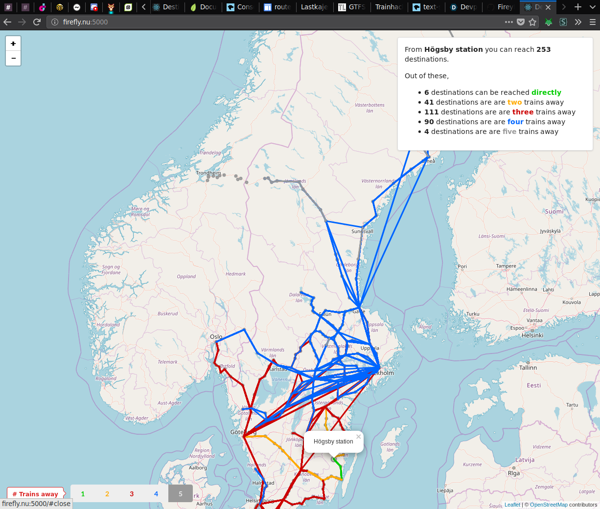

  This repository contains the fruits of our work during Trainhack 2018, a hackathon on rails.

  Destination Unknown is a webapp tool that lets you study how far you can
  reach from a given destination by train, with a limited number of transfers.
  This is interesting in its own, but also useful if you want to coordinate
  picking someone up on the way to a third destination.  Most other train
  route planning tools require you to specify a specific destination.

## Setup
  To set up this project, you need to create the requisite JSON file from the
  [GTFS Sweden 2 dataset][1] from Trafiklab.  There are no precise
  instructions right now, but the right combination of *sweden.zip*, the
  scripts in the 'data' directory and moving its output to 'src/data' should
  do the trick.  Possibly with some slight modification of the scripts
  necessary.

[1]: https://www.trafiklab.se/api/gtfs-sverige-2

## Screenshot

## Project bootstrap
  This project was bootstrapped with [Create React App](https://github.com/facebook/create-react-app).
  You can find the most recent version of its guide [here](https://github.com/facebook/create-react-app/blob/master/packages/react-scripts/template/README.md).
